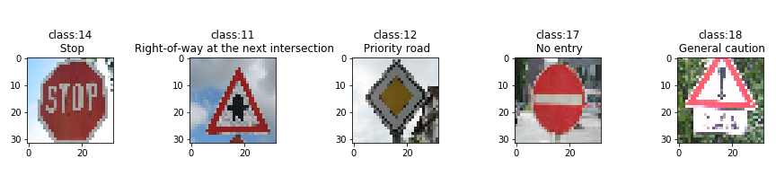

# Traffic Sign Recognition

## 1. Overview
In this project, we build a deep convolutional neural network
for classifying German traffic signs. We train the classification model
based on it and analyze its performance. For this purpose, we use a dataset from
[German Traffic Sign DataSet](http://benchmark.ini.rub.de/?section=gtsrb&subsection=dataset).
The programming code for this project is available in the accompanied notebook
`Traffic_Sign_Classifier.ipynb`.

## 2. Exploratory Data Analysis
In this part, we give a summary of the data that we use for this project. To capture
features of the data, we also provide some visualizations of the data.

The file for the dataset we use for this project can be downloaded from
[here](https://s3-us-west-1.amazonaws.com/udacity-selfdrivingcar/traffic-signs-data.zip).
This file contains three pickled datasets for training, validation and test.
Each file contains 32 pixel x 32 pixel color images (i.e. 3 channels)
of German traffic signs. Each image is described as an array with shape **(32, 32, 3)**
and each entry in the array takes a value in [0, 255].
The size (= the number of images contained) of training/validation/test dataset
is as follows:

- size of training dataset: **34799**
- size of validation dataset: **4410**
- size of test dataset: **12630**

In the datasets, **43** classes for the traffic signs are included.
The examples from these 43 classes (and what they represents)
are visualized below:

Here we also display a bar plot to see the distribution of the 43 classes
in the three datasets (note that the vertical axis denotes what percentage
of images in a dataset are in a given class):  

As one can see in this bar plot, the distribution of the numbers of images
in the 43 classes is not homogeneous. For example, the number of images in
the class `speed limit (50km/h)` is around 10 times more than that of images
in the class `speed limit (20km/h)`. On the other hand, if
the training, validation and test datasets are compared, the distribution for
each dataset takes a similar form, i.e. a percentage of the number of images
in a fixed class is close for the three datasets.  

## 3. Model Building
In this part, we explain our model for traffic sign classification based on
a deep convolutional neural network. For this purpose, we start with
the preprocessing of the dataset. We then introduce the architecture of
our neural network, train it and then analyze the performance of our model.

### 3.1. Preprocessing of Data
Before inputting to our neural network,
we will carry out the following three data preprocessings:
data argumentation and sampling, convert to grayscale, and normalization.

#### Data Argumentation and Sampling
Here we consider three types of data argumentations: translation (up to 4 pixels
in x and y directions), rotation (up to 15 degree) and scaling (up to 5% zoom in/out).
An example of an images before and after the data argumentation is given as follows:

The reason for apply the data argumentation is twofold: First of all, when a camera
equipped to a self-driving car identifies a traffic sign, the sign does not necessarily
face forward and its size in the image varies. In addition to this, the traffic sign is not
necessarily located at the center of the camera image.
It is thus natural to apply data argumentation. Secondly, the data argumentation
helps us to create more training data.

As can be seen in the above bar plot, depending on which class one considers,
the number of the images in a given class highly varies. Thus here we do the following
two things such that each class has the same number of images in the the training dataset
(note that the validation/test dataset is untouched). Let us call the number of the
image in each sample after the preprocessing to be `Nc`. Then,

-  For a given class, if the number of the images in the original training dataset is
larger than or equal to `Nc`, then we randomly pick up `Nc` images.
- For a given class, if the number of the images in the original training dataset is
less than `Nc`, then we carry out the data argumentation to generate images such that
the total number of the images in this class becomes `Nc`.

In this project, we set to **`Nc = 1500`**. Thus, in the training set after the
preprocessing, each class has `Nc` images and the size of the training set
becomes **`N_c x 43 = 64500`**.

#### Convert to Grayscale
We convert the colored images to grayscale.
After this preprocessing, the number of the channel becomes 1 (i.e. the shape
of the array corresponding to the image becomes **(32, 32, 1)**).
An example of images before and after converting to grayscale is given as follows:

The reason for converting to grayscale is that it simplifies the data, while
keeping the important features of the traffic signs such as their shapes. We note
that, as can be seen in the above examples, we can easily distinguish the 43 classes
even the colors are turned off (the traffic signs are designed in such a way that
people with color blindness can distinguish). Another reason is that, some images
are very dark and it is hard to see in human eyes what traffic signs are contained,
but converting
to grayscale makes the contrast vivid and it becomes relatively easier to identify
the traffic sign itself. Finally, converting to grayscale also reduces the size of the input data.

We convert all the three datasets to grayscale .  

#### Normalization
We normalize the data such that each entry in the
32 x 32 x 1 array corresponding to a single grayscale image takes a value in **[-1, 1]**.
We apply this normalization to all the three datasets.

Applying the normalization makes the training of the neural network fast and stable.

(While the array corresponding to a given image changes before and after the normalization,
as can be seen in the code for this project, the visualization with
`imshow(..., cmap = 'gray')` in `mathplotlib` library does not change. I thus do not add
an example of an image before and after the normalization here).

#### Examples of Preprocessed Images

After these data preprocessings, the shape of each image
in the three datasets becomes **(32, 32, 1)**. Each entry in
the array corresponding to an image take a value in **[-1,1]**.
For the size of the datasets, the size of the training dataset is now
**64500** (**1500** images for each class),
while it is not changed for the validation/test set.
Examples of the training data after the preprocessing are as follows:

### 3.2. Architecture of Deep Neural Network
Now we introduce the architecture of the convolutional neural network for our
classification model:

| Layer         		|     Description	        					|
|:---------------------:|:---------------------------------------------:|
| Input         		| shape: 32x32x1 (grayscale image)   							|
| Convolution 5x5     	| 1x1 stride, valid padding, output shape: 28x28x8 	|
| ReLU					|			separately save the output as conv1	for later use			|
| Convolution 4x4     	| 2x2 stride, valid padding, output shape: 13x13x16 	|
| ReLU					|	    separately save the output as conv2 for later use        |
| Convolution 4x4     	| 1x1 stride, valid padding, output shape: 10x10x32 	|
| ReLU					|	    separately save the output as conv3 for later use        |
| Convolution 4x4     	| 2x2 stride, valid padding, output shape 4x4x64 	|
| ReLU					|	    denote the output as conv4 for later use                 |
| Flattening		| conv1, 2, 3, 4 are concatenated after flattening, shape: 13200 |
| Fully connected		| output shape: 512       									|
| ReLU					|	   |
| Fully connected		| output shape: 256        									|
| ReLU					|	   |
| Fully connected		| output shape: 128        									|
| ReLU					|	   |
| Fully connected		| output shape: 43        									|
| Softmax				| output shape: 43 (= number of classes)   |

The architecture of this neural network is motivated by a 2-stage convolutional
neural network considered in [Sermanet-LeCun](http://yann.lecun.com/exdb/publis/pdf/sermanet-ijcnn-11.pdf) and [LeNet](http://yann.lecun.com/exdb/publis/pdf/lecun-01a.pdf).
When connecting from the convolutional layer part to the fully connected layer one,
we concatenate the outputs from all the four convolutional layers.
This generalize the model given in [Sermanet-LeCun](http://yann.lecun.com/exdb/publis/pdf/sermanet-ijcnn-11.pdf)
in the sense that our model has more convolutional and fully connected layers.
We have chosen this architecture since the traffic signs are consists of
large figure (circle, triangle,...) with small figures (numbers in the circle,..)
and the combining output from multiple convolutional layers is expected to
help to capture these multi-scale features.  

### 3.3. Training and Performance of Model
For the training, each weight of the neural network is initialized
by randomly picking up a value obeying the truncated normal distribution with
mean 0 and variance 0.1. Each bias is initialized to zero.
For the loss function, the cross entropy is used.
For the optimizer, we use the Adam optimizer
with the learning rate **`learning_rate = 0.0008`**.
The batch size for the training is taken to **`batch_size = 32`**
and we set the number of the epochs for the training to be **`epochs = 40`**.
We save the model with the best validation accuracy in the course of the training process.  

For our best model, the training/validation/test accuracy is as follows:

- **training accuracy**: **0.997**
- **validation accuracy**: **0.980**
- **test accuracy**: **0.951**

Therefore, our model has successfully achieved the validation accuracy greater than 0.93.
The high accuracies for the validation and test sets ensure the validity of the
architecture of our model.
The history of the training/validation accuracy in the training process is
summarized in the following line plot:

For later use, we also provide a visualization of the normalized confusion matrix
(note that the horizontal/vertical axis corresponds to predicted/true labels)

We note that the explicit values of the precision and recall are computed
in our code for this project (see `Traffic_Sign_Classifier.ipynb`).

### 3.4. Visualizing Convolutional Layers
Before ending this part of the writeup, we provide some visualization of
the convolutional layers. Here we take an image from the test dataset
and visualize the feature map outputs of the first and second convolutional layers.
For the input image (after converting to grayscale and normalization)

the visualization of the feature map outputs for the first and second
convolutional layers are given by:

First convolutional layers:

Second convolutional layers:

We can see that these layers capture the boundaries (where the color changes)
in the traffic sign.
We have also visualized the third and fourth convolutional layers in the
code for this project (see `Traffic_Sign_Classifier.ipynb`), but we could not find any nontrivial
points with our human eyes.

## 4. Analysis on New Images
To analyze our model further, we take five images of the German traffic sign
from internet and classify them with our model. We use
five images of the traffic signs from the website of
[Bicycle Germany](http://bicyclegermany.com/german_bicycle_laws.html).
Since the shapes of the images are different from 32 x 32, we have resized
the original images to 32 x 32. The resized images and their classes are
shown below:

.

We expect that the second (`Right-of-way at the next intersection`)
and fifth image (`General Caution	`) will be difficult to classify correctly
since in 43 classifications, there are many traffic signs which are in the
form of a black figure enclosed by a (red) triangle. On top of this,
these images are in a low resolution, and, especially for the fifth image, the traffic sign
in the image is a bit vague. These facts will make it hard to classify these
images correctly.   

### 4.1. Prediction and Observation

By using our model, the classes of these five images are predicted. The result
are summarized in the table below:

| Image			        |     Prediction	        					|
|:---------------------:|:---------------------------------------------:|
| Stop     		      | Stop   							|
| Right-of-way at the next intersection | Right-of-way at the next intersection 										|
| Priority road			| Priority road				|
| No entry      		| No entry			 			|
| General Caution		| Bumpy Road      	|

That is, 4 out of the 5 images are classified correctly and thus
the accuracy of our model for these five images is **0.80** which is lower
than the test accuracy obtained above (but we note that the number of images
used for evaluating the accuracy here is much smaller than that of the test set).

To look into the details, we display the top 5 predictions (i.e. five classes
with the 5 highest softmax probabilities) for each new image.
The result is visualized as bar plots below:

.

For the first four images which our model classified correctly, the probability
for a single class is very close to 1.00. This is not the case for the fifth image
that was not classified correctly.

Now we look at the
the precision and recall computed for the test dataset
(see `Traffic_Sign_Classifier.ipynb` for list of precision and recall for each class).
For the true class and the predicted class of the fifth image that our model failed to classify,

- recall for the true class `General Caution`: **0.80**
- precision for the predicted class `Bumpy Road` : **0.98**

We note that, when a class has low recall, it means that
images in this class tends to be classified incorrectly.
This explains why our model failed to classify this image.   

## 5. Summary

In this project we have built a model for classifying the German traffic
sign by using the deep convolutional neural network. After some preprocessing
of the data (data argumentation + sampling, convert to grayscale, normalization),
we trained the model. Our trained model based on the convolutional
neural network achieves the classification accuracy 0.951 for the test dataset.
We also used 5 new images of German traffic signs to analyze the performance
of this model further.
